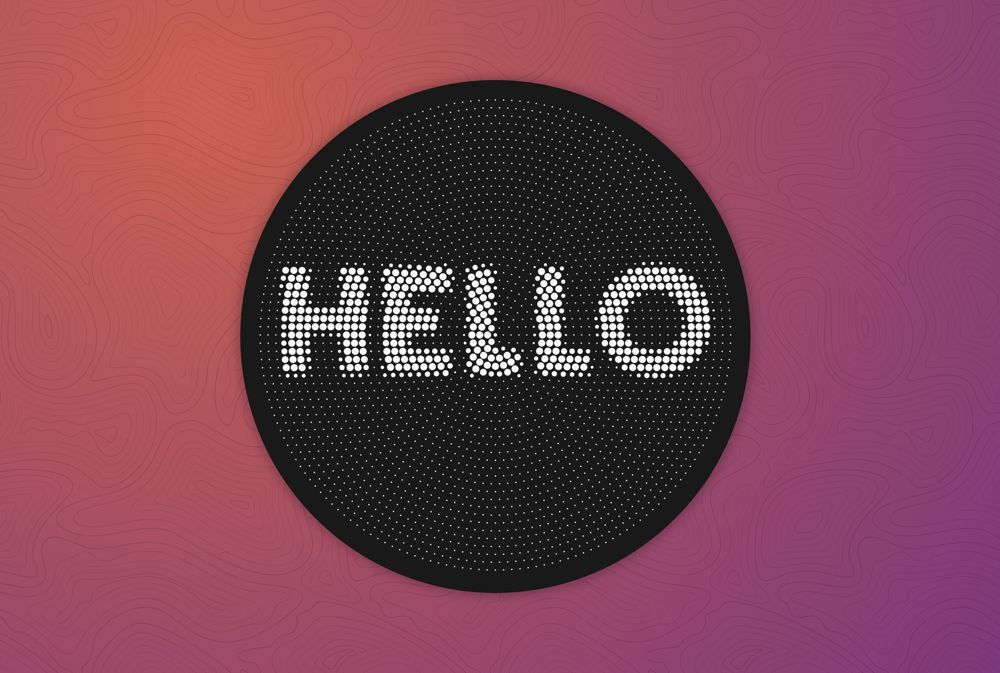

# Vertigo

A tool that transforms raster images into vectors using two distinct _shaders_ - circular dot grid and variable-width spiral.

- [Demo](https://stanko.github.io/vertigo/)

If you find it useful, I also write about similar topics on [my blog](https://muffinman.io).

Feel free to use any images produced by Vertigo as you please, but it would be greatly appreciated if you could include a link back to the website.
